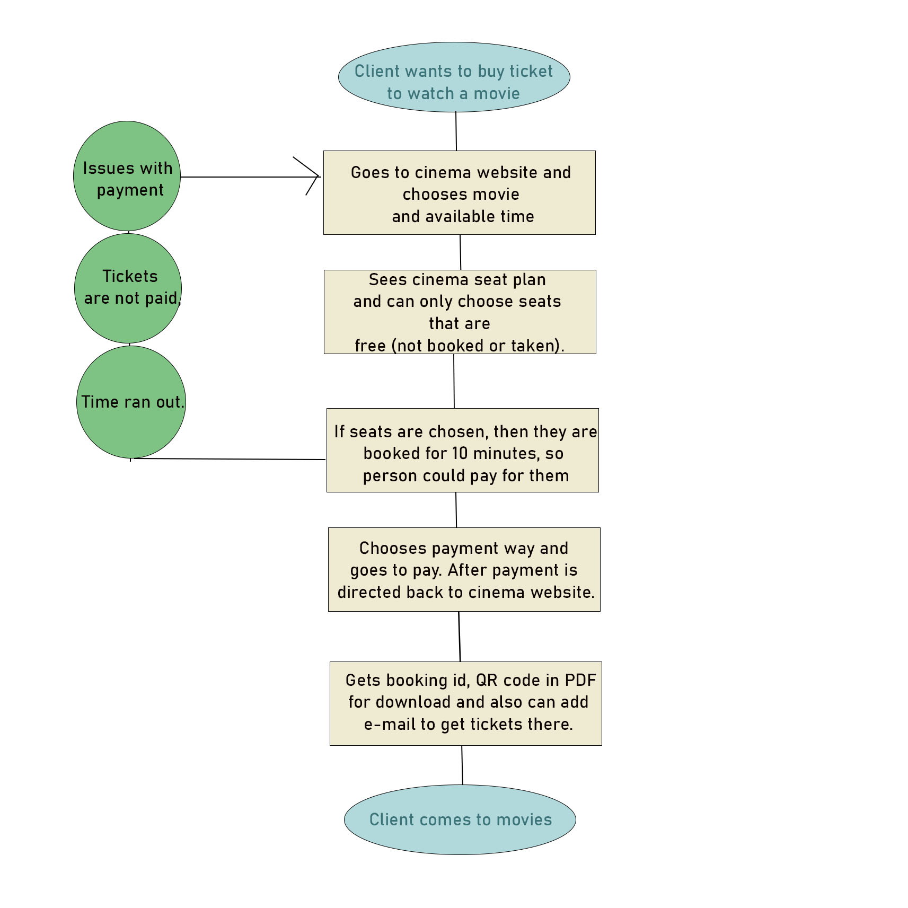

## Task 1

### SCRUM CEREMONIES:

- **Product backlog refinement** - it is the meeting before sprints where you take tasks from the backlog and you refine/specify details that are needed, between team and product owner.
- **Sprint planning** - it is a meeting before sprint, where the goals of sprint and how goals are delivered are put in place.
- **Daily scrum** - it is a meeting where the team gets together every day and every member says what they did yesterday, what they do that day and if there are any blockers.
- **Sprint review** - meeting where the team comes together and sees the end-work/results and see if there are any changes needed.
- **Sprint retrospective** - meeting where the team discusses what went great and what can be improved next time.

### SCRUM ROLES:

- **Scrum Master** - is a development team's team lead/supporter. Scrum Master initiates meetings, coaches, supports and protects the team, communicates, helps with blockers, reports. Scrum Master is between PM and the management.
- **Product Owner** - responsible for the final product, takes feedback from different stakeholders and translates technical and business sides to each other.
- **Development Team** - is a group of people who do the activities (planning, programming, testing, analyzing) to reach the needed goal.

## Task 2

### Epic: Yoga booking system

### Stories: 
- S1 As a yoga class client, I want to see what classes I could take(Classes display)
  - Task 1.1 - Design UI/UX
  - Task 1.2 - Write front-end for booking and classes info (at the same page)
  - Task 1.3 - Connect API to show user-booking and classes info
- S2 As a yoga class client, I want to book new classes (information storing in SQL and booking)
  - Task 2.1 - Design DB architecture
  - Task 2.2 - DB creating
- S3 As a yoga class client, I want to change my information or update my participation (back-end)
  - Task 3.1 - Mapping end-points
  - Task 3.2 - Implementing end-point
    - 3.2.1 - User-booking API
    - 3.2.2 - Classes info API

- S1 tasks 1.1 and 1.2 should be done in order, because you have to have design before you start coding.
- S2 tasks should be done in order, because you can't create database before the design.
- S3 tasks 3.1 and 3.2 should be done in particular order, because you can't implement before mapping, but implementing them can be done in parallel.
- S2, S3 could be also be done parallel and S1 can be done partly in parallel, because you can write front-end with mocked API response when endpoints are not ready. 
- Task 1.1, 2.1, 3.1 - can be done in parallel and 2.1 and 3.1 should be done by system architect(s), to see how everything in the application goes together.

## Task 3

### Epic: Design a cinema booking system.

1. **Think how you would approach the problem and what are potential ways of solving it?**
- A: I would create system process flow, decide main components in architecture and considerations. Also take main components into smaller pieces and use agile method for development.
- Solutions to common or biggest problems in this project:
  -People can't book already booked seats, so person who is the first one booking them, gets the right to book them for 10 minutes, so they could pay. If not, then seats will open again.
  -If third-party applications do not work then people can see error message that they currently can't buy tickets. 
  - If client has entered wrong/mistyped e-mail and has not downloaded PDF or booking id, then they have to call customer service. 

2. **Draw a list of key requirements**
- A: Main features would be:
  2. Client can buy cinema tickets for fixed period of time and for one session at the time.
  3. Client sees seat plan and seat situation(free, booked, taken).
  4. Client can use gift card, credit card or bank transition to pay for tickets. 
  5. After buying tickets client gets ticket/tickets as QR-code and can also send them to email if they want.
  
3. **What are your main considerations?**
- A: Main considerations:
  1. If timing is enough or too much for paying for the tickets, because it is not great for business if seats are too long booked and client does not pay for tickets.
  2. Relying on third-party payment applications, but at the same time they are much more convenient, than paying invoice and developing own system would cost a lot of money and time.
  3. Person send tickets to wrong e-mail/system is down and does not download them or write down booking id. It would be preventable with login as user, but developing takes time and money. So if person booked with wrong e-mail then they should contact with customer service. 
  
4. **What would be your common or biggest problems?**
- A: Main problems:
  1. Different people want to buy same seats at the same time. 
  2. Third-party payment application does not work.
  3. Person does not get tickets to e-mail, because entered wrong/mistyped e-mail. 

5. **What components or tools would you potentially use?**
- A:
  - Use API which is connected with DB to show which seats are available, which ones are sold and reserved.
  - For DB, I would use SQL to track any changes that are happening with seating, every movie would have separate table.
  - For tickets, I would use generated QR-codes.
  - Third-party payment applications like PayPal and also in Estonia we have "Maksekeskus", where you can choose between all the banks in Estonia and make your payment from there. 

6. **You are welcome to draw a diagram (a very simple one) for the process flow to
explain how it is going to work**
- A: 