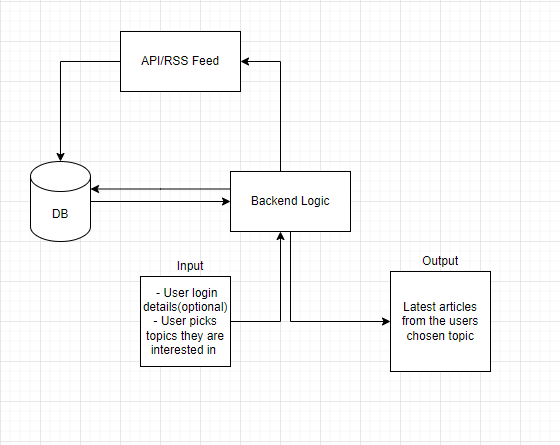

# Project team 1: Christelle, Stacey, Silvia, Sundus and Jin

## 1. What are you building?

Our project allows users to browse a wide range of API’s/RSS feeds across 5 categories (coding languages, cryptocurrency, Machine learning/AI, Technology and Github). We have chosen these topics as they are becoming more and more popular with the current interest in technological advancements and cover a broad spectrum of interests. We tried to get a wide variety of categories all falling under the common interest of technology and computers, we tried to stick to things people in the industry/interested in the industry would want to learn about and keep up to date with. It takes API feeds and RSS to incorporate information in a way that is easy to find and read as users don’t want to be searching for ages to find what they are looking for. 

Our project incorporates RSS which allows users to be notified of new articles they may be interested in which will also aid in taking time away from searching as they will be directed from the notification. Our project will also have a login feature to allow users to create a basic account which saves things like what they are interested in, this will allow us to see the most popular topics and store them in a database ( we are looking at this as a nice to have feature depending on our time constraints overall ). We are also going to be building a database that can store sensitive data using some of mySQLs built-in functions such as password to help encrypt user passwords. This is necessary as security is important no matter what data you are handling but especially when it comes to login details because if they are breached it reduces the credibility of the project and will have negative impacts on users. For the same reasons we are also looking at encryption strategies within our python code as an extra security measure. 

Our project also has a separate database for managing the APIs/Rss feeds. We chose to do 2 separate databases to keep things neater and for usability to help prevent overloading one database as that could cause our project to crash. Another benefit to having 2 databases is that information will be easier to keep track of as we won’t have to search through things we know we don’t need to as we know where the information will be stored. As this is a relatively small project we are looking at managing memory through functions in python as there is no use for a higher level storage solution like cloud as there could be in the real world.  Overall we are building a program that accepts user login which is optional as some people may not want to create accounts and displaying relevant news in relation to our chosen subject of technology, We chose this as it covers a lot of areas and there's something for everyone it is a popular field with a lot of variety which we feel people would want to look into. Once a user logs in or starts browsing they will find a variety of different API links to find related articles. Users also have the option to search by country to make information relevant to them which we think is a nice feature to have and will hopefully encourage users to use our program more. Finally if a user logs in their interests may be saved onto a database for future recommendations ( again this is a nice to have feature but something that has been discussed in group meetings ).

## 2. What does it do or what kind of problem does it solve?

The problem our project will solve is with the vast number of API options out there people don’t know which one to choose and spend more time searching through an array of APIs than actually reading the information they want. It's similar to the issue with Netflix in that you spend more time searching for content than actually looking at the content you want. Our project hopes to put all the popular APIs in one place so that people don’t need to spend forever searching; they can find the right information straight away or at least be pointed in the right direction so they spend a lot less time searching for what they want.  We have also included RSS feeds within our project so that people can be updated when a new article is posted so that they remain up to date with the latest content. We have also taken into consideration the different countries people come from which solves the issue of people struggling to find news relevant to them. Through research it has been found that most APIs tend to cover news from only the USA/UK so we have included sites that allow you to specify your country to provide relevant information solving the issue of having to search through hundreds if not thousands of results showing potentially irrelevant information. Users will have the choice of which county to display where possible which gives them the chance to read news from their own country and others to stay up to date. Overall our project uses research and our own experience to find the most relevant APIS over a range of popular categories and displays results in one place to make learning about technology easy and accessible for users. 

To sum up, from the end-user's perspective, the situation our app is targeting is that of the multitude of news which is available to people in this day and age. Much like the above-mentioned APIs and the Netflix case, given the amount of news available on a daily basis to readers, it could be quite a daunting task to scour through countless websites to find news related to topics of interest, and this approach could turn out to be dispersive and time-consuming. By aggregating news content into a single up-to-date source and consolidating it into news bits displayed to the end user based on their preferences in content, our app hopes to simplify this task and "meet the user halfway" by proposing ready-to-access content they might be interested in.

## 3. What are the key features of your system?

Our system will have: 
- Login feature - client can log in as a user.
- API/RSS feature - to show news to the client of topics that they have chosen.
- SQL database feature for user information - to keep user passwords, IDs, etc.
- SQL database feature for news - to store latest news (topics, titles, etc.).

## 4. Provide a sample architecture diagram of your system?

## 5. Describe a team approach to the project work?
For us project team 1, we mainly used Slack, Atlassian, Google doc and GitHub as team collaboration tools. In the pre-group project stage (6/10-11/10), a meeting was held via zoom where each member introduced themselves and shared their areas of interest. After the discussion, we initially decided not to design a game, while most of the members were interested in the tech sector, we decided to start an APIs search and to think about what we would do based on the general direction of the tech industry. After that, we set up the Atlassian board to track each member’s progress and work goals, and decided to simplify the complexity of communication. Since slack comes with a huddle feature that not only supports multi-person calls and screen sharing, but also supports drawing in other people’s screen presentations, we decided to conduct the following meetings through slack huddle. During the start-up stage (12/10-16/10), we decided to make a software that consolidates information about the technology industry and makes it easy to find and read, and it should connect to SQL databases. In order to achieve that, we assigned different tech areas to different members to do APIs/RSS research and start writing simple code. At the same time we set up a Github repository to share our codes so that others can view or comment on it. We are still working on our respective parts of the code and will be discussing more about the database, login system and how to finish hw2 at the next meeting (19/10).

