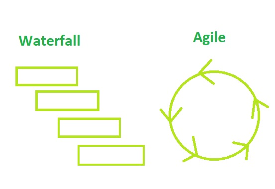

### 1. How does Object-oriented Programming differ from Process Oriented Programming? 
A: Object-oriented programming is divided into the objects, but process-oriented programming is divided into smaller functions. OOP has bottom-up approach and data members can be public/private/default, which can also help hide the data and is more secure. POP has top-to-down approach and the data members are public, also data hiding is impossible. 
Function overloading in OOP is possible, but not possible in POP. OOP is great for solving big problems, and it focuses on data, POP focuses on functions.

### 2. What's polymorphism in OOP?
A: Polymorphism in OOP means you can use same function for different purposes, used and reused many times. Example: you can overwrite something that has different outcome in parent class. Has positive influence to code, because can save time and makes easy to debug if needed.
```
class Animals:
    def __init__(self, name, age):
        self.name = name
        self.age = age
        
    def lives_in_farm(self):
        return True
            
class Dog(Animals):
    def __init__(self, name, age):
        super().__init__(name, age)
        
    def lives_in_farm(self):
        return False

dog_Mika=Dog('Mika', 3)
print(dog_mika.name, dog_mika.age, dog_mika.lives_in_farm())
```
### 3. What's inheritance in OOP?
A: Inheritance in OOP means that we can transfer methods/properties from one class to another. It helps with code reading, reusing and scaling and decreases repetition. Also better and easier to find errors.
```
class Animals:
    def __init__(self, name, age):
        self.name = name
        self.age = age
        
    def lives_in_farm(self):
        return True
            
class Cow(Animals):
    def __init__(self, name, age):
        super().__init__(name, age)       
          
cow_alma=Cow('Alma', 12)
print(cow_alma.name, cow_alma.age, cow_alma.lives_in_farm())
```
### 4. If you had to make a program that could vote for the top three funniest people in the office, how would you do that? How would you make it possible to vote on those people?
- APPROACH: I would firstly make plan, determine needed tools and program architecture. I think in this case it would be great if there would be e-mail link for voting, so everybody could vote one time and they could be identified by e-mail, so we could keep track how has voted and send reminders. The program has multiple choice answer questions, where you can only vote for one person. If there are a lot of different departments, then I would make extra choice, to see who are in which department. After voting is ended, you can see who are three people who got most votes. When somebody is in a tie, then both names are shown.
- KEY REQUIREMENTS:
  - Every employee can vote one time and for one person.
  - They can see later the result if voting is ended.
  - Getting notification if results are out. 
- MAIN CONSIDERATIONS:
  - How to make sure that person votes only one time. 
  - Can person change their vote until the end, just in case they choose wrong person.
  - If there are a lot of people/similar names in list, then how to make system easy for voting, so there would not be confusion. 
- BIGGEST/COMMON PROBLEMS:
    - Confusion with names or people, if there is a lot of employees.
    - People wanting to change their votes.
- COMPONENTS/TOOLS:
    - SQL for holding data and e-mails - who have voted.
    - PYTHON for back-end logic.
    - HTML and CSS for front-end.
    - API for e-mail notifications.

### 5. What's the software development cycle?
A: Software development cycle known as SDLC, is needed to deliver expected goals to client. It has 6 steps:
1. Planning: making plan(s) how to achieve the goal and requirements analysis.
2. Analysis: deciding tool/methods that project is made and how these fill requirements.
3. Design: planning and setting up the architecture, so design would have a suitable logic.
4. Development: coding and making the goal product.
5. Integration and testing: putting all the work pieces together and testing + documentation(architecture, technical, user).
6. Maintenance: deploying, improving and maintaining the product.

### 6. What's the difference between agile and waterfall?
A: Waterfall is more phase-to-phase (linear) and strict approach to development. Waterfall is great for projects that have specific timeline and very concrete requirements, since everything is organized before work starts. Everything is made simple and project can be done without any hurdles. Cons of waterfall are that it is not very flexible, because if changes are made or something goes wrong, there is a chance to have to start again. It also takes time and cost can be big, if there is something that needs to be done fast. Agile is more flexible, there are not many phases and requires more testing, which leads to better customer satisfaction. Projects are divided into smaller pieces and prioritized. Cons of Agile are that there should be clear picture of the goal, team commitment and tight cooperation for project to succeed.
 

### 7. What is a reduced function used for?
A: Reduce function takes list and function of two arguments.
Given functions is cumulatively applied to all list elements. 
Reduce returns cumulated result(single value).
```
import functools 

list= ['Code', 'First', 'Girls']
full_name= functools.reduce(lambda x,y: x+y,list)
print(full_name)

Result: CodeFirstGirls
```
### 8. How does merge sort work?
A: Merge sort is algorithm that takes array and divides it smaller and smaller sub-pieces until the dividing is impossible. Then it sorts the smallest pieces, compares them, sorts them and merges them into a list.   


### 9. Generators - Generator functions allow you to declare a function that behaves like an iterator, i.e. it can be used in a for loop. What is the use case?
A: All generators are iterators. Generator is used for loops, so the loop would not be influenced by loop's iterations and returning values, so it is used for iterating through generator object and returns sequence of values.
Example of using:
```
def get_example(x):
    for i in range(x):
        yield i

example = get_example(5)

print(next(example))
print(next(example))
print(next(example))
```
### 10. Decorators - A page for useful (or potentially abusive?) decorator ideas. What is the return type of the decorator?
A:Decorator takes chosen function as an argument and same time decorator is also regular Python function. 
So it takes the other function as argument and returns a modified class or a function that wraps the original.
We can name decorators as a wrapper for function, and it is changing its action/behavior, and we can use decorator as much as we like, 
because decorator is a function. So it is great for cleaner code and makes 
it easier to use same decorators for different places. Decorators are great to use for modifying functions behavior
without modifying functon itself. 

Decorator can be abusive, when decorators are not used for modifying the behavior of the function, but 
starts to modify the arguments function body itself or violating SOLID principles. 

Basic example of decorator:
```
def decorator_wrapper(func):
    def inner_function():
        print("Hello,")
        func()
        print("Again!")

    return inner_function()


@decorator_wrapper
def my_func():
    print("Mia")
```

Great use of decorator:
``` 
def decorator(func):
    def inner_func(a,b):
        print("Let's sum a and b together")
        func(a,b)
        print("Done!")
    return inner_func

@decorator
def sum(a,b):
    print(a+b)

sum(5,6)
```

